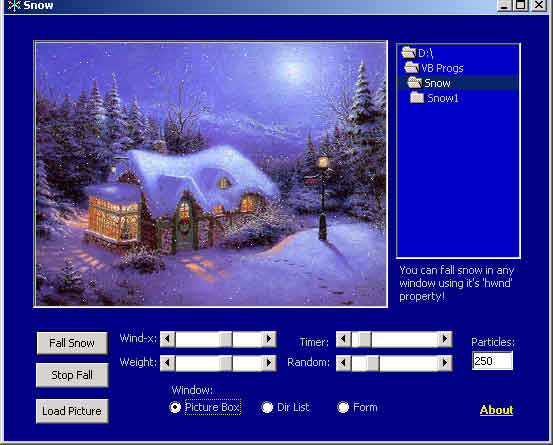



## Snow Simulator\!

### Description

this code is to simulating snow! you can fall it in any window using it's hwnd property such as picture box or command button. you have severall ability to controll the snow: WIND Direction, particles WEIGHT and Random motions. it is better than you think ;-)
 
### More Info
 

             |
---                |---
**Submitted On**   |2002-02-18 14:10:32
**By**             |[Saeed Serpooshan](https://github.com/Planet-Source-Code/PSCIndex/blob/master/ByAuthor/saeed-serpooshan.md)
**Level**          |Intermediate
**User Rating**    |4.9 (83 globes from 17 users)
**Compatibility**  |VB 6\.0
**Category**       |[Graphics](https://github.com/Planet-Source-Code/PSCIndex/blob/master/ByCategory/graphics__1-46.md)
**World**          |[Visual Basic](https://github.com/Planet-Source-Code/PSCIndex/blob/master/ByWorld/visual-basic.md)
**Archive File**   |[Snow\_Simul558112182002\.zip](https://github.com/Planet-Source-Code/saeed-serpooshan-snow-simulator__1-31891/archive/master.zip)

